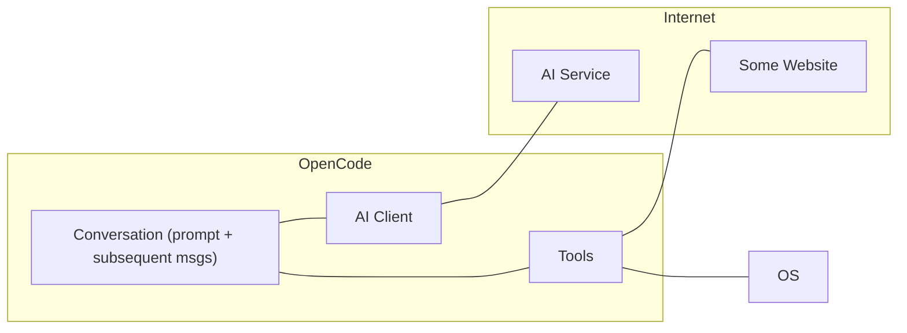
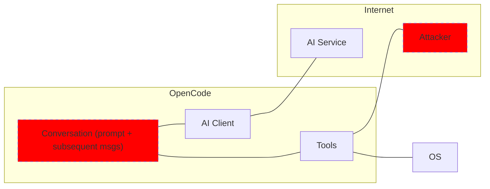
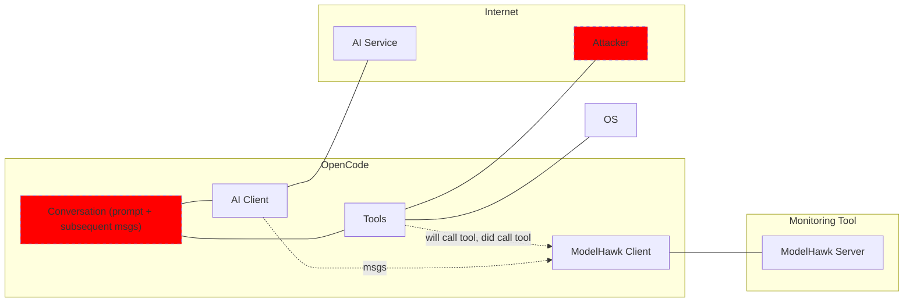

# ModelHawk

## Intro

ModelHawk is a (proposed) standard way of connecting LLM-based tools (like Copilot, Claude, OpenCode) to tools that, for security purposes, monitor or control these LLM-based tools.

**Problem to solve:** We do not yet know how to gain assurance that LLM-based tools will not misbehave (due to, e.g., a prompt-injection attack).
Of course, there are many ideas for this, and more to come in the future. However, if we wanted to test a particular method of securing an LLM-based tool,
we don't have a standard way of hooking it up to such tools.

**Solution:** ModelHawk proposes a small protocol that LLM-based tools, and tools for monitoring them, can follow in order to connect to each other.

## Architecture

Consider OpenCode running on a laptop, shown in the following diagram. It maintains a conversation between the user and the AI. 
It has code for talkikng to an AI service. The AI can call tools (via the conversation) which might
read or write to/from disk or visit websites.

Now consider how an attack might happen. An attacker could have a prompt-injection attack on a website, waiting
for an AI tool to connect to it. When that happens, the poisoned prompt enters the conversation and thus makes
the conversation poisoned, ready to do evil with the tools it has access to.

ModelHawk lets you connect some kind of monitoring tool to the _trusted_ parts of the AI harness (in this case, OpenCode), letting the monitoring tool snoop on the conversation's activities and even approve/deny tool usage.

## The Protocol

It's quite simple.

Messages are serialized with Protocol Buffers. They are defined in `modelhawk/v1` ([docs](gen/docs/docs.md)).

There are two roles:
    - **AI app:** This is the thing that uses AI and that we want to monitor for bad behavior. It implements a ModelHawk client.
    - **Security app:** This is the thing that monitors the AI app for bad behavior. It implements a ModelHawk server.

The security app provides two services:
    - [`NotifyService`](modelhawk/v1/notify_service.proto)
    - [`PermissionService`](modelhawk/v1/permission_service.proto)

The AI app can use `NotifyService` to tell the security app about events --- e.g., the AI model used a tool. The AI app uses `PermissionService` to
ask the security app for permission for the AI model to do something.

That's it!

**NOTE:** At this time, ModelHawk focuses on tool usage. We will probably add more in the future.

## Example

Suppose I run a team and I want to let my people use their favorite AI helpers (e.g. Claude CoWork) for their work. I want to prevent
these AI helpers from exfiltrating confidential calendar data (perhaps due to a prompt-injection attack).

So, I make (local network) service that implements the server part of ModelHawk, and I require my people to configure their AI helpers to connect to this security service as ModelHawk clients and notify this service about all HTTP tool uses (that is, each time a helper goes to a webpage).
My service can then do various things to check for exfiltration --- keyword search, asking another LLM, etc.

Now suppose that our security requirements get tighter, and I want all these AI helpers to ask permission before doing an HTTP request. This can be done by simply
changing how they connect to my monitoring service as ModelHawk clients, and of course modifying my service to return responses as appropriate.
